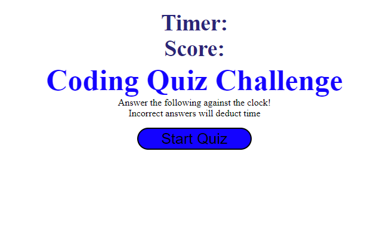

# Dreamshaker
A Quiz game on JavaScript fundamentals 

## JavaScript Fundementals Quiz
This times quiz is focused on JavaScript and stores/shows all the high scores.A series of multiple chioce questions will be asked, deducting points for incorrect answers and awarding points for correct ones. Through out this project i gained better a understanding of storing data in the local storage & retrieving data with 'localStorage.getItem'. The purpose of appending and creating elements with JavaScript became clear and showed its usefulness in working on this project.

## Installations

-Open in browser to view the web page (Link here - https://thorne7.github.io/Dreamshaker/ )
-Open in Visual Studio Code to view the code (if no VS code, open your developer window)

## Credits 

Tutorials used during this challenge:

https://www.w3schools.com/js/js_htmldom_eventlistener.asp
https://www.w3schools.com/js/js_window_location.asp
https://www.w3schools.com/js/js_json_parse.asp
https://www.w3schools.com/js/js_htmldom_document.asp

## Licence 

MIT